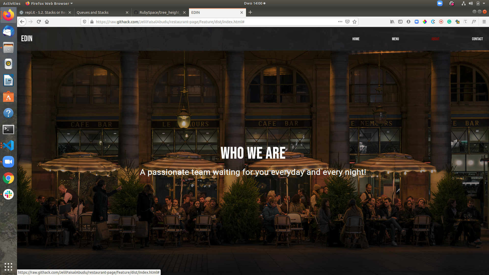

# Restaurant Page

> A simple single page web app built with pure JavaScript.

## Table of Contents

- [Built With](#Built-With)
- [Installation](#Installations)
- [Contributing](#Contributing)
- [Acknowledgments](#Acknowledgments)
- [License](#License)



This project is one of the Microverse students' solo assignment of the JavaScript module.
To build a solid foundation in the modern JavaSCript, each major feature of the app was built separately and exported as a module. These modules the home page, navigation, about, menu and the contact pages.

## Built With

- JavaScript,
- SASS/CSS
- Bootstrap,
- NPM
- Webpack,
- VsCode

## Live Demo

[Live Demo Link](https://raw.githack.com/JelilFaisalAbudu/restaurant-page/development/dist/index.html)

## Getting Started

To get a local copy up and running follow these simple example steps.

- Click the dropdown button having the download icon.

  - Clone the repository copying the URL and pasting it into your terminal app.
  ```git clone https://github.com/JelilFaisalAbudu/restaurant-page.git```
  Note: You need to have git installed on your machine in order to successfully perform this operation.
  In case you don't have git installed, use the other means.
  
  - Download the Zip file by clicking the zip icon. Remember to unzip it after the download.

- Navigate to the project's directory/folder in your terminal

- Run ```npm install``` to install the necessary dependencies.

- Directly open the the file ```dist/index.html``` with your browser to view the pages.

- Run ```npm run develop``` to bundle the codes after making changes to them.

- Run ```npm run build``` to bundle the code for production.

### Installation

In order to perform the last four operation, you must have following tools installed.

- Node.  Click on the link [install](https://nodejs.org/en/) for the installation instructions for your OS.

- Run ```npm install npm@latest -g``` to update to the latest npm version.

## Authors

👤 **Author**

- Github: [JelilFaisalAbudu](https://github.com/JelilFaisalAbudu)
- Twitter: [@jelilabudu](https://twitter.com/jelilabudu)
- Linkedin: [jelilfaisalabudu](www.linkedin.com/in/jelilfaisalabudu)

## 🤝 Contributing

Contributions, issues and feature requests are welcome!

Feel free to check the [issues page](https://github.com/JelilFaisalAbudu/restaurant-page/issues)

## Show your support

Give a ⭐️ if you like this project!

## Acknowledgments

- Unsplash for free photos

## 📝 License

This project is [GPL](http://www.gnu.org/licenses/gpl.txt) licensed.
